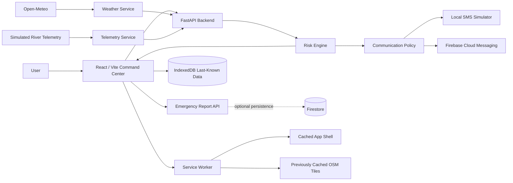

# FlashFlood

**Hyperlocal flood early-warning and resilient evacuation-support prototype with backend risk evaluation, offline last-known data, maps, and simulated emergency communications.**

FlashFlood is a portfolio project that demonstrates how current weather data, deterministic river telemetry, explainable risk evaluation, degraded/offline operation, and communication fallback logic can be combined into one emergency command-center workflow.

> **Prototype only:** FlashFlood is an academic software prototype. It is not an operational emergency-warning system. It does not send real SMS, contact emergency services, provide official flood boundaries, or guarantee warnings or delivery.

## Overview

Flood-monitoring information can come from different sources such as weather data, river measurements, maps, and communication systems. FlashFlood brings these components into one software workflow while maintaining clear boundaries between live data, cached data, risk assessment, and communication.

**Cached or stale data may be displayed, but it cannot create a new risk assessment or trigger new emergency communications.**

| At a glance | Current implementation |
|---|---|
| Project type | B.Sc. IT Major Project |
| Frontend | React 19 + Vite 8 + Tailwind CSS 4 |
| Backend | FastAPI + Pydantic |
| Weather | Current/forecast rainfall from Open-Meteo |
| River data | Deterministic simulated telemetry |
| Risk authority | FastAPI backend only |
| Maps | Leaflet + OpenStreetMap |
| Offline | IndexedDB + Service Worker + cached OSM tiles |
| SMS | Local simulation only - no telecom provider |
| Firebase | Firestore persistence + Firebase Cloud Messaging |
| Verification | 171 backend tests passed + production frontend build |

## Key Features

- **Explainable risk assessment** - combines rainfall, river level, river change, and discharge into a deterministic backend risk result with reasons and recommended action.
- **Weather + telemetry pipeline** - normalizes two-location Open-Meteo data and combines it with selectable simulated upstream river scenarios.
- **Emergency reporting prototype** - bounded categories and messages with backend validation and an explicit notice that it does not contact emergency services.
- **Simulated SMS fallback** - RED-escalation demonstration path with generated message, timestamp, simulated recipient, and simulated delivery state. No real SMS is sent.
- **Offline resilience** - last-known weather, telemetry, and risk can remain visible when live requests fail.
- **Map resilience** - previously loaded OpenStreetMap tiles can be reused from the Service Worker cache.
- **Operating modes** - distinguishes `FULL ONLINE`, `DEGRADED`, and `OFFLINE`.
- **Safety boundaries** - stale data is labelled `LAST KNOWN - NOT LIVE`; cached inputs never create a new risk result, FCM event, or SMS event.

## System Architecture



The backend remains authoritative for risk evaluation. The React frontend does not reproduce the risk formula.

For the full architecture and trust boundaries, see [`docs/architecture.md`](docs/architecture.md).

## Risk Assessment Flow

```text
Current valid weather + current valid telemetry
                    |
                    v
           POST /api/risk/evaluate
                    |
                    v
          FastAPI risk evaluation
                    |
                    v
       Level + score + reasons
          + recommended action
                    |
                    v
                Dashboard
                    |
                    v
       Communication policy
          on live escalation
```

The risk engine evaluates four severity signals:

1. Derived rainfall severity
2. River-level severity
3. River-change severity
4. Upstream-discharge severity

The current prototype score is:

```text
score = (25 x D) + (4 x S1) + (4 x S2)
```

where:

```text
D >= S1 >= S2 >= S3
```

| Score | Display level |
|---:|---|
| 0-24 | GREEN - NORMAL |
| 25-49 | YELLOW - WATCH |
| 50-74 | ORANGE - WARNING |
| 75-100 | RED - DANGER |

These are demonstration thresholds and are not scientifically calibrated universal flood-warning limits.

Detailed scoring: [`docs/risk-model.md`](docs/risk-model.md)

## Weather + Telemetry

### Weather

The backend requests Open-Meteo data independently for two prototype locations:

- **Mokokchung, Nagaland** - upstream weather reference.
- **Sonari / Charaideo, Assam** - downstream study area.

Weather coverage is normalized as:

```text
FULL
PARTIAL
UNAVAILABLE
```

Missing provider data is never converted into zero rainfall.

Details: [`docs/weather.md`](docs/weather.md)

### Telemetry

River telemetry is deterministic demonstration data from:

```text
UPSTREAM-DEMO-01
```

with four selectable scenarios:

```text
normal
watch
moderate-surge
critical-surge
```

It is simulated telemetry, not a live sensor network.

Details: [`docs/telemetry.md`](docs/telemetry.md)

## Offline Resilience

FlashFlood uses three separate browser-side mechanisms.

### IndexedDB Last-Known Data

Successful weather, telemetry, and risk snapshots are stored with a capture timestamp.

If live requests later fail, valid cached values may be shown as:

```text
LAST KNOWN - NOT LIVE

Captured: <timestamp>
```

Cached weather and telemetry are **display-only** and never create a new offline risk result.

### Service Worker Application Shell

The Service Worker keeps previously loaded application resources available where possible.

Backend `/api/` responses are not intentionally used as an offline authoritative API cache.

### OpenStreetMap Tile Cache

Previously requested OSM tiles are stored in a separate bounded cache.

Offline maps work only for areas whose tiles were loaded earlier.

### Operating Modes

| Mode | Meaning |
|---|---|
| `FULL ONLINE` | Browser online, backend reachable, required feeds live |
| `DEGRADED` | Browser online but backend or one or more required live feeds are unavailable |
| `OFFLINE` | Browser reports no network connectivity |

Browser network state and backend reachability are tracked separately.

## Communication System

| Component | Status | Meaning |
|---|---|---|
| Risk-transition logic | **Implemented** | Backend evaluates live severity increases |
| Local SMS fallback | **Simulated** | Generates a local event/message only; no phone network is contacted |
| Demo recipient | **Simulated** | Synthetic recipient reference only |
| Emergency report API | **Implemented prototype** | Narrow validated report schema |
| Real emergency-service connection | **Not implemented** | No dispatch to emergency authorities |
| FCM | **Connected and verified in development** | Firebase Cloud Messaging is configured and end-to-end browser delivery has been verified |
| Firestore | **Configured and verified in development** | Firestore persistence has been successfully tested through the backend |

For the local demonstration configuration:

```text
FIRESTORE_ENABLED=false
FCM_ENABLED=true
SMS_SIMULATOR_ENABLED=true
```

A live lower-risk baseline followed by a live escalation to RED can produce a generated fallback message, timestamp, `SIMULATED_DELIVERED`, synthetic demo recipient, and trigger reason.

No Twilio, Vonage, MSG91, AWS SNS, or other telecom provider is integrated.

**Offline or cached risk cannot create SMS or FCM events.**

## Technology Stack

| Area | Technology |
|---|---|
| Project | B.Sc. Information Technology Major Project |
| Frontend | React 19, React DOM 19, Vite 8, Tailwind CSS 4, Axios |
| Maps | Leaflet 1.9.4, React Leaflet 5, OpenStreetMap |
| Offline | Service Worker, Cache API, native IndexedDB |
| Backend | Python 3, FastAPI 0.141.1, Pydantic / pydantic-settings |
| External weather | Open-Meteo |
| HTTP client | HTTPX |
| Cloud services | Firebase Web SDK 12.19.0, Firebase Admin SDK 7.7.0 |
| Database | Firebase Firestore |
| Notifications | Firebase Cloud Messaging |
| Testing | Pytest / unittest-compatible backend suite, FastAPI TestClient |

## Project Structure

```text
FlashFlood/
|
+-- backend/
|   +-- app/
|   |   +-- api/
|   |   +-- core/
|   |   +-- models/
|   |   +-- services/
|   +-- tests/
|   +-- .env.example
|   +-- requirements.txt
|
+-- frontend/
|   +-- public/
|   |   +-- sw.js
|   |   +-- firebase-messaging-sw.js
|   +-- src/
|   |   +-- components/
|   |   +-- hooks/
|   |   +-- services/
|   |   +-- utils/
|   +-- .env.example
|   +-- package.json
|
+-- docs/
|   +-- architecture.md
|   +-- demo.md
|   +-- risk-model.md
|   +-- telemetry.md
|   +-- weather.md
|
+-- README.md
```

## Running Locally

### Backend

```powershell
cd backend
python -m venv .venv
.\.venv\Scripts\Activate.ps1
python -m pip install -r requirements.txt
Copy-Item .env.example .env
python -m uvicorn app.main:app --reload
```

API:

```text
http://127.0.0.1:8000
```

FastAPI documentation:

```text
http://127.0.0.1:8000/docs
```

### Frontend

```powershell
cd frontend
npm install
Copy-Item .env.example .env
npm run dev
```

Default URL:

```text
http://localhost:5173
```

Firebase Web configuration is required for the Firebase/FCM development path. Firebase Admin credentials remain backend-only and must never be placed in frontend code or committed to Git.

The normal local SMS demonstration can also operate without the Firebase cloud services when the corresponding backend flags are disabled.

## Testing

Verified project checkpoint:

```text
171 backend tests passed
121 backend subtests passed
Frontend production build passed
git diff --check passed
```

Run the backend tests:

```powershell
cd backend
python -m pytest
```

Run the frontend production build:

```powershell
cd ..\frontend
npm run build
```

## Demo

Recommended demonstration sequence:

1. Normal live state
2. Warning scenario
3. Critical RED scenario
4. Simulated SMS fallback
5. Backend failure -> `DEGRADED`
6. Browser offline -> cached `LAST KNOWN - NOT LIVE`
7. Recovery -> `FULL ONLINE`

Step-by-step guide: [`docs/demo.md`](docs/demo.md)

## Documentation

- [`docs/architecture.md`](docs/architecture.md) - architecture, responsibilities, connectivity, and trust boundaries.
- [`docs/demo.md`](docs/demo.md) - presentation sequence.
- [`docs/risk-model.md`](docs/risk-model.md) - scoring and thresholds.
- [`docs/weather.md`](docs/weather.md) - weather normalization and failure behavior.
- [`docs/telemetry.md`](docs/telemetry.md) - deterministic demonstration telemetry.
- [`docs/assets/README.md`](docs/assets/README.md) - screenshot capture plan.

## Security Boundaries

The project follows a security-conscious baseline appropriate for an academic prototype:

- Backend authority for risk evaluation
- Pydantic validation for API inputs
- Constrained demonstration-scenario identifiers
- Narrow emergency-report schema
- Firebase Admin credentials kept backend-only
- Environment and credential files ignored by Git
- Unavailable weather is not silently converted to zero
- Cached risk remains display-only
- Cached data cannot trigger new communications
- Service Worker caching does not intentionally turn API responses into offline authoritative state

This is **not** a claim that the prototype is production-secure or attack-proof.

A real operational deployment would require additional authentication, authorization, infrastructure security, monitoring, auditability, operational data sources, communication infrastructure, and validation by the responsible authorities.

## Known Limitations

- Weather comes from Open-Meteo model data, not an official flood-warning authority.
- River telemetry is simulated.
- Risk thresholds are demonstration values.
- Prototype study locations are not claimed to be a scientifically validated gauge pair.
- Affected-area geometry is not an official flood boundary.
- Prototype shelters are not official evacuation centers.
- There is no hydrodynamic flood model.
- There is no road-level evacuation-routing engine.
- SMS delivery is simulated and local state resets when the backend restarts.
- Real end-to-end FCM delivery has been verified in the development environment; production delivery still depends on deployment configuration and browser permission.
- Emergency reports do not contact emergency services.
- Offline data is last-known display data only.
- Offline maps are limited to previously cached tiles.
- Browser network status alone cannot prove backend availability.
- Firebase and FCM availability depends on correct project configuration, browser support, permissions, and deployment configuration.

## Screenshots

No screenshots are fabricated for this repository.

A real-screen capture plan is documented in [`docs/assets/README.md`](docs/assets/README.md).

Recommended screenshots:

1. Main command center - `FULL ONLINE`
2. Critical risk state
3. Simulated SMS fallback
4. Offline last-known data

Only screenshots captured from the real running application should be added to the repository.

## Academic Project Context

FlashFlood is developed as a **B.Sc. Information Technology major project**.

The project focuses on applying software engineering concepts to a flood early-warning prototype, including:

- Web application development
- Backend API development
- Database and cloud service integration
- Risk evaluation logic
- Data validation
- Offline-first browser mechanisms
- Service Worker technology
- Communication fallback concepts
- Software testing
- Security considerations
- System architecture and documentation

The system is intended for academic demonstration and evaluation. It should not be treated as a replacement for official flood-warning systems or emergency-management authorities.

## Future Scope

Possible future development includes:

- Integration with verified official river telemetry sources
- Integration with verified flood-extent datasets
- Improved spatial analysis
- More detailed historical data analysis
- Public-facing safety information interface
- Improved evacuation-support features
- Stronger authentication and authorization
- Production-grade notification infrastructure
- Better monitoring and audit logging
- Validation using real-world hydrological datasets

Any future integration of official datasets would require verification of the source, data quality, update frequency, licensing, and reliability before being treated as an authoritative input.

## Disclaimer

**FlashFlood is an educational software prototype, not an operational emergency system.**

Do not use this project as the sole basis for personal safety, evacuation, emergency response, flood prediction, or public warning decisions.

It does not provide guaranteed warnings, guaranteed communication delivery, official flood boundaries, official shelter information, real SMS delivery, or emergency-service integration.
