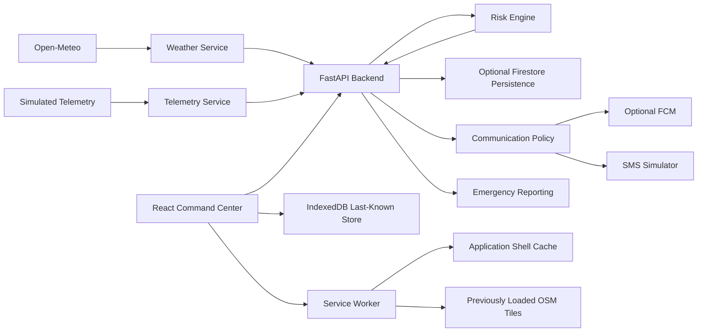

# FlashFlood

**Hyperlocal Early-Warning & Resilient Evacuation Support System**

FlashFlood is an educational flood-monitoring and evacuation-support prototype built as a B.Sc. IT project. It combines live weather data from Open-Meteo, deterministic simulated river telemetry, an explainable FastAPI risk engine, a React command-center interface, prototype study-area mapping, optional persistence/notification integrations, a local SMS fallback simulator, emergency-report submission, and offline last-known-data support.

The system is designed for software demonstration and portfolio use. It is **not** an operational emergency-warning service.

## Problem

Flood-warning information often comes from separate sources: rainfall forecasts, river measurements, local maps, and communication channels. FlashFlood demonstrates how these inputs can be normalized into one transparent workflow while preserving an important safety boundary: unavailable or stale data is never silently treated as fresh data.

The prototype focuses on:

- combining weather and river signals,
- producing an explainable backend risk result,
- showing the result in a monitoring-oriented command center,
- demonstrating fallback communication logic,
- retaining previously loaded information during connectivity loss,
- making simulated and prototype-only elements explicit.

## Key Capabilities

- Two-location weather integration using Open-Meteo.
- Deterministic simulated river telemetry with four demo scenarios.
- Backend-only risk evaluation with warning reasons and recommended action.
- React command center with live/degraded/offline status.
- Leaflet/OpenStreetMap study-area visualization.
- Prototype affected-area and shelter overlays.
- One-time browser location check against the prototype affected polygon.
- Optional Firestore persistence for risk/communication records.
- Optional Firebase Cloud Messaging integration path.
- Local simulated SMS fallback for portfolio demonstrations.
- Prototype emergency-report submission with strict input validation.
- IndexedDB last-known weather, telemetry, and risk display.
- Service Worker application-shell caching.
- Previously loaded OpenStreetMap tile caching.
- Clear `LIVE` versus `LAST KNOWN — NOT LIVE` presentation.

## High-Level Architecture



See [`docs/architecture.md`](docs/architecture.md) for a more detailed description.

## Technology Stack

| Area | Technology |
|---|---|
| Frontend | React 19, Vite 8, Tailwind CSS 4, Axios |
| Maps | Leaflet 1.9.4, React Leaflet 5, OpenStreetMap |
| Offline | Service Worker, Cache API, native IndexedDB |
| Backend | FastAPI 0.141.1, Pydantic / pydantic-settings |
| External weather | Open-Meteo |
| Optional persistence / push | Firebase Admin SDK 7.7.0, Firebase Web SDK 12.19.0 |
| Backend HTTP | HTTPX |
| Testing | Python unittest-compatible suite, FastAPI TestClient; pytest can run the suite when installed |

No extra browser caching or state-management library is used.

## Risk Evaluation Flow

The frontend does **not** calculate the authoritative risk level.

```text
valid current weather
        +
valid current telemetry
        ↓
POST /api/risk/evaluate
        ↓
FastAPI risk engine
        ↓
risk level + score + reasons + recommended action
        ↓
React Command Center
```

The engine scores four severities:

1. derived rainfall severity,
2. river-level severity,
3. river-change severity,
4. upstream-discharge severity.

The severities are sorted:

```text
D >= S1 >= S2 >= S3
```

The prototype score is:

```text
score = (25 × D) + (4 × S1) + (4 × S2)
```

Risk bands:

| Score | Level |
|---:|---|
| 0–24 | GREEN — NORMAL |
| 25–49 | YELLOW — WATCH |
| 50–74 | ORANGE — WARNING |
| 75–100 | RED — DANGER |

The natural maximum produced by the current four-signal formula is 99. Thresholds are demonstration values, not scientifically calibrated universal warning limits.

Detailed rules are documented in [`docs/risk-model.md`](docs/risk-model.md).

## Weather Data Flow

The backend requests Open-Meteo data independently for:

- **Upstream weather reference:** Mokokchung, Nagaland.
- **Downstream study area:** Sonari / Charaideo, Assam.

For each location, the backend normalizes current rainfall and a six-hour prototype forecast window. The cross-location aggregated values use the maximum valid upstream/downstream value; they are not added or averaged.

Coverage can be:

- `FULL`
- `PARTIAL`
- `UNAVAILABLE`

Only full, valid weather coverage can participate in a new automated risk evaluation. Missing rainfall is never converted into zero.

See [`docs/weather.md`](docs/weather.md).

## Telemetry / Demo Flow

River telemetry is deterministic demonstration data from station:

```text
UPSTREAM-DEMO-01
```

Available scenarios:

| Scenario | River level | Change | Discharge |
|---|---:|---:|---:|
| `normal` | 1.20 m | 0.02 m/hour | 100 m³/s |
| `watch` | 2.20 m | 0.15 m/hour | 250 m³/s |
| `moderate-surge` | 3.20 m | 0.35 m/hour | 500 m³/s |
| `critical-surge` | 4.40 m | 0.75 m/hour | 900 m³/s |

Changing a scenario requests new telemetry and, when valid current weather is available, requests a new backend risk assessment.

Telemetry is simulated. It is not a live sensor feed.

See [`docs/telemetry.md`](docs/telemetry.md).

## Emergency Reporting

The frontend includes a prototype emergency-report panel with fixed categories and a bounded message field.

Important behavior:

- the panel clearly states that it does **not** contact emergency services,
- exact location, phone number, email, identity fields, and client-controlled status fields are not accepted,
- backend validation rejects extra identity/location fields,
- persistence is available only when emergency reporting and Firestore are configured,
- there is no automatic offline queue or background upload.

With Firebase/Firestore intentionally unconfigured, the reporting path remains unavailable rather than pretending a report was stored.

## SMS Fallback Simulation

FlashFlood does not send real SMS messages.

The SMS feature is a **SIMULATED SMS FALLBACK** intended for portfolio/demo use.

Two simulator modes exist:

1. **Free local portfolio mode**
   - `SMS_SIMULATOR_ENABLED=true`
   - `FIRESTORE_ENABLED=false`
   - `FCM_ENABLED=false`
   - live backend risk evaluations establish an in-memory transition baseline,
   - a live escalation to `RED` creates a simulated fallback event in backend memory,
   - the event contains a generated message, timestamp, simulated delivery status, and demo recipient reference,
   - state resets when the backend process restarts.

2. **Persistence-backed simulator path**
   - when Firestore is configured, the existing Stage 12 communication policy remains FCM-first,
   - RED uses simulated SMS only when there are zero successful FCM destinations,
   - simulated events can be stored in `sms_messages`.

No Twilio, Vonage, MSG91, AWS SNS, or other telecom provider is integrated.

Cached/offline risk cannot generate SMS because Stage 13B cached risk is display-only and is never submitted as a new backend risk evaluation.

## Offline Architecture

FlashFlood has three separate offline mechanisms.

### Application Shell

`frontend/public/sw.js` uses the Service Worker / Cache API to retain previously loaded application resources.

Backend `/api/` requests are not stored as application-shell responses.

### IndexedDB Last-Known Data

`frontend/src/services/offlineStore.js` stores successful non-sensitive prototype snapshots:

- weather,
- telemetry,
- risk assessment.

Each entry contains:

```text
{
  data,
  savedAt
}
```

If a live request later fails, valid cached data may be displayed as:

```text
LAST KNOWN — NOT LIVE
Captured: <savedAt>
```

The original saved timestamp is retained. Cached weather and telemetry are never used to calculate a new offline risk assessment.

### Cached Map Tiles

The Service Worker keeps a separate bounded cache for OpenStreetMap tiles:

```text
flashflood-map-tiles-v1
```

Only tiles that were previously requested successfully can be reused offline. FlashFlood does **not** provide a complete offline GIS map or offline routing.

Static prototype layers—affected area, reference points, and shelters—remain frontend data.

## Operating Modes

The command center distinguishes browser connectivity from backend reachability.

### FULL ONLINE

- browser network is online,
- backend is reachable,
- required weather, telemetry, and risk data are live.

### DEGRADED

Examples:

- browser network is online but the backend is unavailable,
- one or more required live feeds are unavailable,
- last-known data may still be displayed.

### OFFLINE

- browser reports no network connectivity,
- cached shell/data/map tiles may be displayed,
- no offline risk calculation or communication escalation occurs.

`navigator.onLine` is treated only as a client connectivity indicator. It does not prove the backend is reachable.

## Repository Layout

```text
FlashFlood/
├── backend/
│   ├── app/
│   │   ├── api/routes/
│   │   ├── core/
│   │   ├── models/
│   │   └── services/
│   ├── tests/
│   ├── .env.example
│   └── requirements.txt
├── frontend/
│   ├── public/sw.js
│   ├── src/
│   │   ├── components/
│   │   ├── hooks/
│   │   └── services/
│   ├── .env.example
│   └── package.json
├── docs/
│   ├── architecture.md
│   ├── demo.md
│   ├── risk-model.md
│   ├── telemetry.md
│   └── weather.md
└── README.md
```

## Installation

### Backend

From the repository root:

```powershell
cd backend
python -m venv .venv
.\.venv\Scripts\Activate.ps1
python -m pip install -r requirements.txt
Copy-Item .env.example .env
```

Start FastAPI:

```powershell
python -m uvicorn app.main:app --reload
```

Default backend:

```text
http://127.0.0.1:8000
```

FastAPI documentation:

```text
http://127.0.0.1:8000/docs
```

### Frontend

In another terminal:

```powershell
cd frontend
npm install
Copy-Item .env.example .env
npm run dev
```

Default Vite development URL:

```text
http://localhost:5173
```

## Environment Configuration

Both `.env.example` files contain placeholders/defaults only. Do not commit real credentials.

### Backend defaults

Important options include:

```text
FIRESTORE_ENABLED=false
FCM_ENABLED=false
SMS_SIMULATOR_ENABLED=false
EMERGENCY_REPORTING_ENABLED=false
```

For the free local SMS portfolio demo:

```text
FIRESTORE_ENABLED=false
FCM_ENABLED=false
SMS_SIMULATOR_ENABLED=true
```

### Frontend defaults

Important options include:

```text
VITE_API_BASE_URL=http://127.0.0.1:8000
VITE_FCM_ENABLED=false
VITE_SMS_SIMULATOR_ENABLED=false
VITE_EMERGENCY_REPORTING_ENABLED=True
```

For the SMS demo panel:

```text
VITE_SMS_SIMULATOR_ENABLED=true
```

Restart the development servers after changing environment values.

`VITE_EMERGENCY_REPORTING_ENABLED=True` exposes the prototype reporting UI locally; the backend still controls whether a report can actually be accepted and persisted. With Firestore/Firebase intentionally unconfigured, this does not create a real emergency-service integration.

Firebase Admin credentials must remain backend-only. Firebase Web configuration is public application configuration, but this repository intentionally leaves real Firebase integration for later.

## Testing and Build

Backend tests:

```powershell
cd backend
python -m unittest discover -s tests -v
```

If pytest is already installed in the development environment, the same suite can also be run with:

```powershell
python -m pytest
```

Frontend production build:

```powershell
cd frontend
npm run build
```

Git whitespace check:

```powershell
git diff --check
```

No frontend test framework is added solely for this portfolio pass.

## Portfolio Demo

See [`docs/demo.md`](docs/demo.md) for a short presentation workflow covering:

1. normal conditions,
2. warning conditions,
3. critical conditions,
4. local simulated SMS fallback,
5. backend failure / degraded mode,
6. browser offline mode,
7. recovery.

## Security Considerations

The current prototype uses a security-conscious baseline:

- backend authority for risk evaluation,
- Pydantic validation for API inputs,
- constrained telemetry scenario identifiers,
- strict emergency-report fields,
- no browser coordinates stored in the communication subsystem,
- no phone number required by the SMS simulator,
- Firebase Admin credentials kept out of frontend code,
- environment/credential files ignored by Git,
- unavailable weather is not converted to zero,
- cached risk is display-only,
- application-shell/map caches do not intentionally cache backend API responses.

This is not a claim of attack-proof security. A real deployment would require authentication/authorization, operational secrets management, infrastructure controls, monitoring, auditability, stronger distributed communication deduplication, and review by the responsible authorities.

## Known Limitations

- Weather comes from Open-Meteo model data rather than official flood-warning authorities.
- River telemetry is simulated.
- Risk thresholds are prototype demonstration values.
- Study locations are not presented as a scientifically validated hydrological gauge pair.
- Prototype affected-area geometry is not an official flood boundary.
- Prototype shelters are not official evacuation centers.
- There is no hydrodynamic flood model.
- There is no road-level evacuation routing.
- The local SMS simulator does not send real SMS and resets on backend restart.
- Real end-to-end FCM delivery is not currently claimed as verified/configured.
- Emergency-report persistence requires configured Firestore and does not contact emergency services.
- Offline weather/telemetry/risk are last-known display data only.
- Offline map support is limited to previously cached tiles.
- Browser `navigator.onLine` cannot prove backend reachability.
- Communication deduplication in a real distributed deployment would require stronger transactional guarantees.

## Prototype Disclaimer

**FlashFlood is an educational software prototype, not an operational emergency system.**

Do not use this repository as the sole basis for personal safety, evacuation, emergency response, flood prediction, or public warning decisions. It does not provide guaranteed warnings, guaranteed communication delivery, official flood boundaries, official shelter data, or emergency-service integration.
