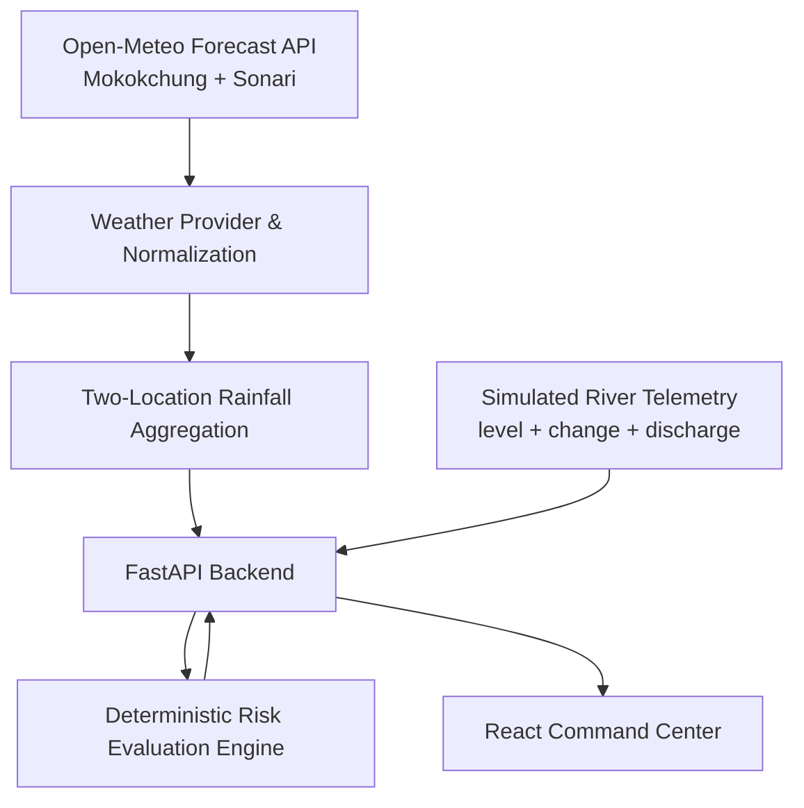
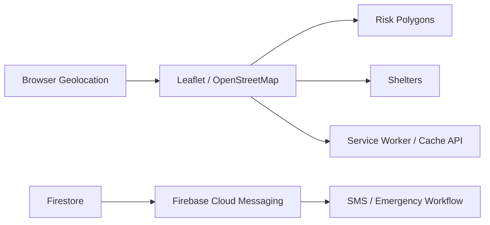

# FlashFlood

**Hyperlocal Early-Warning & Resilient Evacuation Support System**

FlashFlood is a prototype web-based flood early-warning and evacuation-support system developed as a B.Sc. IT academic project. The current implementation combines two-location rainfall data from Open-Meteo, simulated upstream river telemetry, deterministic backend risk evaluation, and a React command-center interface.

The project is implemented through **Stage 6**. GIS mapping, risk polygons, shelters, geolocation, database-backed operations, notifications, SMS fallback, and offline support are planned for later stages and are **not currently implemented**.

---

## 1. Project Overview

FlashFlood demonstrates how several environmental inputs can be brought together into one explainable warning workflow:

- local rainfall/weather information for an upstream and downstream study location,
- simulated upstream river level, river-change, and discharge telemetry,
- deterministic warning evaluation in the FastAPI backend,
- backend-generated warning reasons and recommended actions,
- a React disaster-monitoring command center,
- selectable demonstration telemetry scenarios for presentation and testing.

The current system is intentionally small and explainable. It is designed to demonstrate the software architecture and data flow of an early-warning prototype rather than to act as an operational flood-warning service.

Planned later work includes affected-area/risk-polygon logic, shelters, browser geolocation, notifications and fallback communication, database integration, and offline support.

---

## 2. Important Prototype Disclaimer

FlashFlood is an **educational and demonstration prototype**.

- Warning thresholds used by the project are prototype/demonstration thresholds only.
- River level, river-change, and upstream discharge telemetry are simulated demonstration data.
- The current system is not a guaranteed flood-prediction system.
- It does not perform live hydrodynamic flood simulation.
- It does not guarantee road-by-road evacuation routing.
- The two study locations do not represent a scientifically validated gauge pair or a proven hydrological pathway.
- Open-Meteo supplies weather data; it does not predict floods for FlashFlood.
- Real deployment would require official river gauges, locally validated thresholds, field validation, authoritative emergency communication infrastructure, operational security controls, and validation by the responsible authorities.

---

## 3. Primary Study Configuration

| Role | Location | Coordinates |
|---|---|---|
| Downstream study area | Sonari / Charaideo, Assam | 27.0280, 95.0312 |
| Upstream weather reference | Mokokchung, Nagaland | 26.31393, 94.51675 |

These locations are used for the current prototype only. The project does not claim that this configuration is a universal flood model or a scientifically validated hydrological relationship between the two exact points.

---

## 4. Project Status

The implementation currently reaches **Stage 6**.

| Stage | Scope | Status |
|---|---|---|
| 1 | Project Setup | COMPLETED |
| 2 | FastAPI Foundation | COMPLETED |
| 3 | Risk Engine | COMPLETED |
| 4 | Simulated Telemetry | COMPLETED |
| 5 | Open-Meteo Integration | COMPLETED |
| 6 | React Command Center | COMPLETED |
| 7 | Leaflet / OpenStreetMap | PLANNED |
| 8 | Risk Polygons & Shelters | PLANNED |
| 9 | Browser Geolocation | PLANNED |
| 10 | Firestore | PLANNED |
| 11 | Firebase Cloud Messaging | PLANNED |
| 12 | SMS Simulator & Emergency Reporting | PLANNED |
| 13 | Offline Support | PLANNED |
| 14 | Full Integration | PLANNED |
| 15 | Final Testing & Documentation | PLANNED |

Stage 6 is checkpointed in Git with:

```text
721d45d Stage 6: Add React command center dashboard
```

---

## 5. Architecture

### Implemented flow



The frontend does not independently determine the authoritative risk level. It gathers valid weather and telemetry responses, submits the required measurements to the backend, and displays the backend risk result.

### Planned later modules



The modules in the second diagram are roadmap items and are not part of the current Stage 6 implementation.

---

## 6. Technology Stack

### Implemented

| Area | Technology |
|---|---|
| Frontend | React 19, Vite 8, Tailwind CSS 4, Axios |
| Backend | Python, FastAPI, Pydantic, pydantic-settings |
| External weather data | Open-Meteo Forecast API |
| HTTP client | HTTPX |
| Telemetry | Deterministic simulated telemetry records |
| Testing | Python `unittest`, FastAPI TestClient, mocked weather HTTP responses |
| Version control | Git, GitHub |

### Planned

- Leaflet
- OpenStreetMap
- Firestore
- Firebase Cloud Messaging
- HTML5 Geolocation
- Service Worker
- Cache API

Planned technologies are listed as project direction only and should not be interpreted as already implemented.

---

## 7. Warning / Risk Engine

The current risk engine scores **four signals**:

1. derived rainfall severity,
2. river-level severity,
3. river-change severity,
4. upstream-discharge severity.

Severity values are represented as:

| Severity | Value |
|---|---:|
| GREEN | 0 |
| YELLOW | 1 |
| ORANGE | 2 |
| RED | 3 |

The four severities are sorted:

```text
D >= S1 >= S2 >= S3
```

The implemented score is:

```text
score = (25 × D) + (4 × S1) + (4 × S2)
```

`S3` remains available for classification and explanation but contributes `0` numeric points to the score.

### Risk bands

| Score | Risk level |
|---:|---|
| 0–24 | GREEN |
| 25–49 | YELLOW |
| 50–74 | ORANGE |
| 75–100 | RED |

The model emphasizes the dominant signal while limiting excessive double-counting among multiple elevated inputs.

These values are **prototype rules**, not scientifically validated universal flood-warning thresholds.

---

## 8. Rainfall Rules

### Forecast rainfall

| Forecast rainfall | Severity |
|---|---|
| `<= 30 mm/hour` | GREEN |
| `> 30 mm/hour` | YELLOW |

### Live rainfall

| Live rainfall | Severity |
|---|---|
| `<= 30 mm/hour` | GREEN |
| `> 30 and <= 50 mm/hour` | ORANGE |
| `> 50 mm/hour` | RED |

The derived rainfall severity used by the risk engine is the maximum of the live and forecast rainfall severities after the two-location weather data has been aggregated.

All rainfall thresholds are **prototype/demonstration thresholds only**.

---

## 9. River and Discharge Demonstration Rules

### River level

| River level | Severity |
|---|---|
| `< 2 m` | GREEN |
| `2–<3 m` | YELLOW |
| `3–<4 m` | ORANGE |
| `>= 4 m` | RED |

### River change

| River change | Severity |
|---|---|
| `< 0.10 m/hour` | GREEN |
| `0.10–<0.30 m/hour` | YELLOW |
| `0.30–<0.60 m/hour` | ORANGE |
| `>= 0.60 m/hour` | RED |

### Upstream discharge

| Upstream discharge | Severity |
|---|---|
| `< 200 m3/s` | GREEN |
| `200–<400 m3/s` | YELLOW |
| `400–<800 m3/s` | ORANGE |
| `>= 800 m3/s` | RED |

These river and discharge values are demonstration thresholds for the simulated station and are not scientifically calibrated operational limits.

---

## 10. Open-Meteo Integration

Stage 5 introduced a two-location Open-Meteo provider.

The backend currently:

- queries Mokokchung and Sonari independently,
- normalizes each response into application-domain weather models,
- keeps upstream and downstream weather separate,
- distinguishes valid zero rainfall from unavailable weather data,
- tracks `AVAILABLE`, `PARTIAL`, and `UNAVAILABLE` weather states,
- retains driver-location metadata for aggregated rainfall,
- does not construct a complete automated risk input when full required weather coverage is unavailable.

The provider requests:

```text
current=rain,showers
hourly=rain,showers
precipitation_unit=mm
timezone=GMT
```

The configured prototype forecast horizon is:

```text
WEATHER_FORECAST_HORIZON_HOURS=6
```

### Live rainfall

```text
live rainfall intensity
= (current.rain + current.showers) × 3600 / current.interval
```

This is an **equivalent hourly intensity derived from the current model interval**, not a directly observed one-hour accumulation.

### Forecast rainfall

The backend selects six complete future one-hour intervals, excluding the current incomplete interval. For each selected hour:

```text
hourly rainfall = hourly.rain + hourly.showers
```

It then uses the:

> **peak forecast hourly rainfall within the selected six-hour prototype window**

If multiple intervals share the same peak value, the earliest peak time is retained for deterministic output.

The six-hour window is a prototype design choice and is not claimed to be scientifically optimal.

### Two-location aggregation

```text
aggregated_live = max(upstream_live, downstream_live)

aggregated_forecast = max(upstream_forecast, downstream_forecast)
```

The corresponding driver location or locations are retained. The system does not add or average the two locations.

Open-Meteo is used only as a weather-data provider. Flood-warning scoring remains in the backend risk service.

---

## 11. Simulated Telemetry

The prototype contains four deterministic telemetry scenarios:

| Scenario | River level | River change | Upstream discharge |
|---|---:|---:|---:|
| `normal` | 1.20 m | 0.02 m/hour | 100 m3/s |
| `watch` | 2.20 m | 0.15 m/hour | 250 m3/s |
| `moderate-surge` | 3.20 m | 0.35 m/hour | 500 m3/s |
| `critical-surge` | 4.40 m | 0.75 m/hour | 900 m3/s |

The simulated station ID is:

```text
UPSTREAM-DEMO-01
```

Each record contains timestamp, station ID, river level, river-change rate, upstream discharge, scenario, and data source. The source is explicitly marked as simulated demonstration data.

---

## 12. Backend API

| Method | Route | Purpose |
|---|---|---|
| `GET` | `/api/health` | Check backend service health and version |
| `POST` | `/api/risk/evaluate` | Evaluate prototype flood risk and return the backend result |
| `GET` | `/api/telemetry/latest` | Return the latest selected simulated telemetry record |
| `GET` | `/api/telemetry/demo/{scenario}` | Select and return a deterministic demonstration telemetry scenario |
| `GET` | `/api/weather` | Return the normalized two-location weather snapshot |

FastAPI's generated API documentation is normally available at:

```text
http://127.0.0.1:8000/docs
```

---

## 13. React Command Center

Stage 6 provides the first functional command-center dashboard.

Current areas include:

- **CURRENT RISK**
  - risk level,
  - risk score,
  - assessment timestamp,
  - assessment inputs,
  - **WHY THIS WARNING**,
  - **RECOMMENDED ACTION**,
- **UPSTREAM WEATHER**,
- **DOWNSTREAM WEATHER**,
- **RIVER TELEMETRY**,
- **DATA HEALTH**,
- **DEMONSTRATION CONTROLS**.

The dashboard also exposes backend connectivity, data availability, source information, and freshness/timestamps. Weather unavailability is shown as unavailable data rather than being silently displayed as zero rainfall.

The interface uses a restrained emergency-operations-console visual direction with dark flat surfaces, thin borders, dense operational information, and explicit risk-state text.

Authoritative risk evaluation is **not performed in React**. The frontend submits measurements to the backend and displays the returned backend result.

---

## 14. Demonstration Flow

```text
Scenario selection
        ↓
GET /api/telemetry/demo/{scenario}
        ↓
Returned telemetry
        +
Current valid weather data
        ↓
POST /api/risk/evaluate
        ↓
Backend risk result
        ↓
React command center
```

The frontend has no hard-coded mapping such as:

```text
normal -> GREEN
watch -> YELLOW
moderate-surge -> ORANGE
critical-surge -> RED
```

During Stage 6 browser verification, the demonstration run produced:

| Scenario tested | Backend result observed |
|---|---|
| NORMAL | GREEN |
| WATCH | YELLOW |
| MODERATE SURGE | ORANGE |
| CRITICAL SURGE | RED |

These are recorded test observations, not a permanent frontend mapping. Real weather remains part of the backend request and can influence the actual result.

---

## 15. Security Approach

FlashFlood follows a security-first prototype baseline rather than claiming to be attack-proof.

### Current baseline

- The backend is the authority for risk decisions.
- FastAPI/Pydantic models validate API inputs.
- Telemetry scenarios are constrained to defined identifiers.
- The frontend also restricts demo requests to the known scenario allowlist.
- CORS origins are configured in backend settings.
- External weather requests are isolated behind the weather service.
- Weather data and units are validated before use.
- Unavailable external data is not silently converted to zero.
- Frontend API errors are mapped to controlled operator-facing messages.
- Environment files and common credential files are excluded from Git.
- No administrative credentials are exposed in frontend code.
- Unnecessary frontend dependencies are avoided.

### Planned security work

Later database, authentication, notification, and administration stages will require:

- authentication and authorization,
- least-privilege database access,
- secure Firestore rules,
- protected administrative operations,
- secure notification credential handling,
- security-oriented integration testing.

The project does not claim complete or guaranteed security.

---

## 16. Project Structure

```text
FlashFlood-stage1/
├── backend/
│   ├── .env.example
│   ├── requirements.txt
│   ├── app/
│   │   ├── main.py
│   │   ├── api/
│   │   │   └── routes/
│   │   │       ├── health.py
│   │   │       ├── risk.py
│   │   │       ├── telemetry.py
│   │   │       └── weather.py
│   │   ├── core/
│   │   │   ├── config.py
│   │   │   └── risk_thresholds.py
│   │   ├── models/
│   │   │   ├── health.py
│   │   │   ├── risk.py
│   │   │   ├── telemetry.py
│   │   │   └── weather.py
│   │   └── services/
│   │       ├── risk_service.py
│   │       ├── telemetry_service.py
│   │       ├── weather_service.py
│   │       └── rainfall_aggregation_service.py
│   └── tests/
├── frontend/
│   ├── .env.example
│   ├── package.json
│   ├── vite.config.js
│   └── src/
│       ├── App.jsx
│       ├── main.jsx
│       ├── index.css
│       ├── components/
│       │   └── dashboard/
│       │       ├── DemoScenarioControls.jsx
│       │       ├── RiskStatusCard.jsx
│       │       ├── RiverTelemetryCard.jsx
│       │       ├── SystemStatus.jsx
│       │       ├── WarningReasons.jsx
│       │       └── WeatherCard.jsx
│       ├── hooks/
│       │   └── useCommandCenterData.js
│       └── services/
│           └── api.js
├── docs/
│   ├── risk-model.md
│   ├── telemetry.md
│   └── weather.md
├── .editorconfig
├── .gitignore
└── README.md
```

---

## 17. Development Roadmap

| Stage | Description | Status |
|---|---|---|
| 1 | Project Setup | COMPLETED |
| 2 | FastAPI Foundation | COMPLETED |
| 3 | Risk Engine | COMPLETED |
| 4 | Simulated Telemetry | COMPLETED |
| 5 | Open-Meteo Integration | COMPLETED |
| 6 | React Command Center | COMPLETED |
| 7 | Leaflet / OpenStreetMap | PLANNED |
| 8 | Risk Polygons & Shelters | PLANNED |
| 9 | Browser Geolocation | PLANNED |
| 10 | Firestore | PLANNED |
| 11 | Firebase Cloud Messaging | PLANNED |
| 12 | SMS Simulator & Emergency Reporting | PLANNED |
| 13 | Offline Support | PLANNED |
| 14 | Full Integration | PLANNED |
| 15 | Final Testing & Documentation | PLANNED |

---

## 18. Testing

### Backend

The repository currently contains **101 backend `unittest` test methods** across health, risk API/service, telemetry, weather provider/API, and rainfall aggregation tests.

Weather tests use mocked HTTP responses, so normal automated tests do not depend on the live Open-Meteo network.

Run the backend suite with:

```powershell
cd backend
.\.venv\Scripts\Activate.ps1
python -m unittest discover -s tests -v
```

The current repository inventory confirms the 101-test suite structure. A fresh suite execution should be used whenever backend application code changes.

### Frontend

The real Windows Stage 6 production build was verified successfully:

```text
vite v8.3.0 building client environment for production...
79 modules transformed.
built successfully in 768 ms
```

Stage 6 was also browser-tested against the real local backend. Verification covered:

- dashboard load,
- real Open-Meteo weather display,
- telemetry demo API flow,
- backend `/api/risk/evaluate` flow,
- network request verification,
- frontend/backend responsibility separation,
- NORMAL,
- WATCH,
- MODERATE SURGE,
- CRITICAL SURGE,
- emergency-operations-console UI review.

---

## 19. How to Run

### Prerequisites

- Git
- Python 3.10+
- Node.js compatible with the installed Vite version
- npm

### Backend setup

```powershell
cd backend

python -m venv .venv
.\.venv\Scripts\Activate.ps1

python -m pip install --upgrade pip
python -m pip install -r requirements.txt
```

Start FastAPI:

```powershell
python -m uvicorn app.main:app --reload
```

Default local API:

```text
http://127.0.0.1:8000
```

Use `backend/.env.example` as the configuration template. Do not commit a real `.env` file.

### Frontend

```powershell
cd frontend
npm install
npm run dev
```

The local Vite server normally runs at:

```text
http://localhost:5173
```

Current frontend example configuration:

```text
VITE_API_BASE_URL=http://127.0.0.1:8000
VITE_REFRESH_INTERVAL_MS=60000
```

### Production frontend build

```powershell
cd frontend
npm run build
```

### Backend tests

```powershell
cd backend
.\.venv\Scripts\Activate.ps1
python -m unittest discover -s tests -v
```

---

## 20. Limitations

Current limitations include:

- simulated upstream river telemetry,
- prototype river/discharge/rainfall thresholds requiring local validation,
- a limited two-location study configuration,
- external weather-data dependency,
- weather-model information rather than physical rain-gauge observations,
- no guaranteed flood prediction,
- no live hydrodynamic simulation,
- no guaranteed road-by-road evacuation routing,
- no implemented GIS risk polygons or shelters yet,
- no browser geolocation yet,
- no Firestore/database functionality yet,
- no Firebase Cloud Messaging yet,
- no SMS fallback workflow yet,
- no offline support yet.

---

## 21. Future Scope

Planned work includes:

- official river-gauge integration,
- locally validated warning thresholds,
- improved GIS and terrain modelling,
- larger study areas,
- risk polygons,
- shelter mapping,
- browser geolocation,
- Firestore,
- Firebase Cloud Messaging,
- SMS fallback simulation and emergency-reporting workflow,
- stronger offline map/data support,
- authorized emergency communications,
- additional hazard triggers beyond rainfall where appropriate,
- broader field testing and validation.

---

## 22. Academic Note

FlashFlood is an academic prototype created for educational and demonstration purposes. Its current value is in demonstrating an explainable software workflow that connects environmental data, simulated telemetry, deterministic warning evaluation, and an operator-facing command center.

Real-world deployment would require substantial scientific, operational, legal, security, accessibility, and field validation, together with integration into authoritative monitoring and emergency-management systems.

No license is stated here because the repository currently does not contain a `LICENSE` file.
