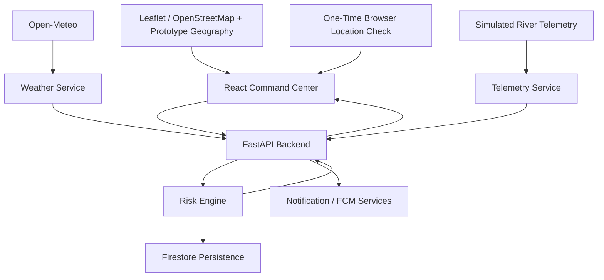
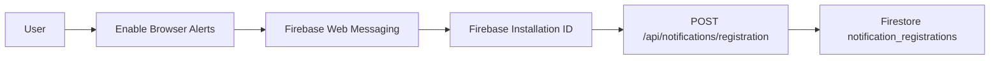
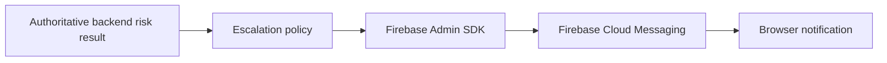

# FlashFlood

**Hyperlocal Early-Warning & Resilient Evacuation Support System**

FlashFlood is a prototype web-based flood early-warning and evacuation-support system developed as a B.Sc. IT academic project. The current implementation combines two-location rainfall data from Open-Meteo, simulated upstream river telemetry, deterministic backend risk evaluation, a React command-center interface, Leaflet/OpenStreetMap study-area mapping, prototype affected-area and shelter layers, a one-time browser location check, Firestore persistence, and Firebase Cloud Messaging integration.

The project is implemented through **Stage 11**. SMS/emergency reporting, broader offline support, full integration, and final testing/documentation remain later stages. The Stage 11 FCM implementation is present and verified in disabled/mock-backed modes, but real end-to-end Firebase browser push delivery has **NOT been verified** because a real Firebase Web configuration, VAPID setup, and cloud delivery path were not connected and tested.

---

## 1. Project Overview

FlashFlood demonstrates how several environmental inputs can be brought together into one explainable warning workflow:

- local rainfall/weather information for an upstream and downstream study location,
- simulated upstream river level, river-change, and discharge telemetry,
- deterministic warning evaluation in the FastAPI backend,
- backend-generated warning reasons and recommended actions,
- a React disaster-monitoring command center,
- selectable demonstration telemetry scenarios for presentation and testing.

The current system is intentionally small and explainable. It is designed to demonstrate the software architecture and data flow of an early-warning prototype rather than to act as an operational flood-warning service.

Implemented stages now also cover study-area mapping, prototype affected-area/shelter layers, browser geolocation, Firestore persistence, and the Stage 11 FCM notification path. Later roadmap work begins with Stage 12 SMS Simulator & Emergency Reporting, followed by Stage 13 offline support, Stage 14 full integration, and Stage 15 final testing/documentation.

---

## 2. Important Prototype Disclaimer

FlashFlood is an **educational and demonstration prototype**.

- Warning thresholds used by the project are prototype/demonstration thresholds only.
- River level, river-change, and upstream discharge telemetry are simulated demonstration data.
- The current system is not a guaranteed flood-prediction system.
- It does not perform live hydrodynamic flood simulation.
- It does not guarantee road-by-road evacuation routing.
- The two study locations do not represent a scientifically validated gauge pair or a proven hydrological pathway.
- Open-Meteo supplies weather data; it does not predict floods for FlashFlood.
- Real deployment would require official river gauges, locally validated thresholds, field validation, authoritative emergency communication infrastructure, operational security controls, and validation by the responsible authorities.

---

## 3. Primary Study Configuration

| Role | Location | Coordinates |
|---|---|---|
| Downstream study area | Sonari / Charaideo, Assam | 27.0280, 95.0312 |
| Upstream weather reference | Mokokchung, Nagaland | 26.31393, 94.51675 |

These locations are used for the current prototype only. The project does not claim that this configuration is a universal flood model or a scientifically validated hydrological relationship between the two exact points.

---

## 4. Project Status

The implementation currently reaches **Stage 11**.

| Stage | Scope | Status |
|---|---|---|
| 1 | Project Setup | COMPLETED |
| 2 | FastAPI Foundation | COMPLETED |
| 3 | Risk Engine | COMPLETED |
| 4 | Simulated Telemetry | COMPLETED |
| 5 | Open-Meteo Integration | COMPLETED |
| 6 | React Command Center | COMPLETED |
| 7 | Leaflet / OpenStreetMap | COMPLETED |
| 8 | Risk Polygons & Shelters | COMPLETED |
| 9 | Browser Geolocation | COMPLETED |
| 10 | Firestore | COMPLETED |
| 11 | Firebase Cloud Messaging | COMPLETED |
| 12 | SMS Simulator & Emergency Reporting | PLANNED |
| 13 | Offline Support | PLANNED |
| 14 | Full Integration | PLANNED |
| 15 | Final Testing & Documentation | PLANNED |

Current documentation checkpoint:

```text
a9a9251 Stage 11: Add Firebase Cloud Messaging
3c2744a Update README through Stage 10
8e1f5bd Stage 10: Add Firestore persistence
```

---

## 5. Architecture

### Implemented high-level flow



The frontend does not independently determine the authoritative risk level. Risk evaluation remains in the FastAPI backend. The map and browser-location features are presentation/local-browser features and do not change the warning formula.

Stage 10 persists validated risk assessments to Firestore when persistence is enabled. Stage 11 adds browser-notification registration and server-side FCM delivery without making Firebase availability part of the risk decision.

### Stage 11 - Firebase Cloud Messaging

Stage 11 implements:

- Firebase Web Messaging integration using Firebase Web SDK 12.19.0,
- Firebase Installation ID (FID)-based browser registration,
- explicit user-controlled notification permission,
- `POST /api/notifications/registration`,
- Firestore `notification_registrations`,
- SHA-256-derived registration document IDs,
- bounded registration validation and prototype in-memory rate limiting,
- backend-only Firebase Admin SDK sending,
- server-controlled notification titles/bodies,
- notification attempts only when authoritative backend risk severity increases,
- a minimal FCM-only service worker for background messaging,
- FCM disabled-by-default local development,
- safe isolation so FCM failures do not change the risk response.

Browser registration flow:



Notification delivery flow:



The frontend does **not** send warning notifications itself and does not decide whether an escalation occurred.

The implemented notification collection is conceptually:

```text
notification_registrations
  installation_id
  enabled
  created_at
  updated_at
```

Registration document IDs are derived on the backend from a SHA-256 hash of the FID. Exact browser coordinates, location history, user names, email addresses, and phone numbers are not stored in this collection. The project does not currently invent a user-account relationship for these registrations.

Current escalation policy:

```text
GREEN -> YELLOW   notify
YELLOW -> ORANGE  notify
ORANGE -> RED     notify

same level        no escalation notification
lower level       no escalation notification
first assessment  establish baseline only
```

The transition is determined from backend risk state, not from browser state. The current prototype comparison is not a transactionally deduplicated distributed notification system; production use would require stronger concurrency/delivery guarantees.

FCM remains disabled by default:

```text
FCM_ENABLED=false
VITE_FCM_ENABLED=false
```

The Stage 11 service worker is limited to FCM background messaging/browser notification support. It does **not** implement app-shell caching, offline maps, Cache API application storage, network fallback, or background sync. Broader offline behavior remains Stage 13.

> **Real FCM limitation:** Real end-to-end Firebase browser push delivery has **NOT been verified**. The Stage 11 implementation, automated tests/mocks, disabled-mode behavior, production frontend build, and browser regressions were verified, but a real Firebase Web configuration, VAPID setup, and cloud FCM delivery path were not connected and tested. The project therefore does not claim verified real browser push delivery.

### Planned later modules

- Stage 12 - SMS Simulator & Emergency Reporting
- Stage 13 - broader offline support
- Stage 14 - full integration
- Stage 15 - final testing and documentation

---

## 6. Technology Stack

### Implemented

| Area | Technology |
|---|---|
| Frontend | React 19, Vite 8, Tailwind CSS 4, Axios, Firebase Web SDK 12.19.0 |
| Maps | Leaflet 1.9.4, React Leaflet 5.0.0, OpenStreetMap |
| Browser capabilities | HTML5 Geolocation, Notification/Service Worker support used by Stage 11 |
| Backend | Python, FastAPI, Pydantic, pydantic-settings, Firebase Admin SDK 7.7.0 |
| Data / persistence | Firestore, deterministic simulated telemetry records |
| External weather data | Open-Meteo Forecast API |
| HTTP client | HTTPX |
| Testing | Python `unittest`, FastAPI TestClient, mocked external/Firebase behavior where appropriate |
| Version control | Git, GitHub |

### Planned beyond Stage 11

- SMS simulator and emergency-reporting workflow,
- broader offline support using Service Worker / Cache API concepts,
- full cross-module integration and final project validation.

Firebase Web configuration is public application configuration. Firebase Admin credentials remain server-side and are not part of the React bundle.

---

## 7. Warning / Risk Engine

The current risk engine scores **four signals**:

1. derived rainfall severity,
2. river-level severity,
3. river-change severity,
4. upstream-discharge severity.

Severity values are represented as:

| Severity | Value |
|---|---:|
| GREEN | 0 |
| YELLOW | 1 |
| ORANGE | 2 |
| RED | 3 |

The four severities are sorted:

```text
D >= S1 >= S2 >= S3
```

The implemented score is:

```text
score = (25 × D) + (4 × S1) + (4 × S2)
```

`S3` remains available for classification and explanation but contributes `0` numeric points to the score.

### Risk bands

| Score | Risk level |
|---:|---|
| 0–24 | GREEN |
| 25–49 | YELLOW |
| 50–74 | ORANGE |
| 75–100 | RED |

The model emphasizes the dominant signal while limiting excessive double-counting among multiple elevated inputs.

These values are **prototype rules**, not scientifically validated universal flood-warning thresholds.

---

## 8. Rainfall Rules

### Forecast rainfall

| Forecast rainfall | Severity |
|---|---|
| `<= 30 mm/hour` | GREEN |
| `> 30 mm/hour` | YELLOW |

### Live rainfall

| Live rainfall | Severity |
|---|---|
| `<= 30 mm/hour` | GREEN |
| `> 30 and <= 50 mm/hour` | ORANGE |
| `> 50 mm/hour` | RED |

The derived rainfall severity used by the risk engine is the maximum of the live and forecast rainfall severities after the two-location weather data has been aggregated.

All rainfall thresholds are **prototype/demonstration thresholds only**.

---

## 9. River and Discharge Demonstration Rules

### River level

| River level | Severity |
|---|---|
| `< 2 m` | GREEN |
| `2–<3 m` | YELLOW |
| `3–<4 m` | ORANGE |
| `>= 4 m` | RED |

### River change

| River change | Severity |
|---|---|
| `< 0.10 m/hour` | GREEN |
| `0.10–<0.30 m/hour` | YELLOW |
| `0.30–<0.60 m/hour` | ORANGE |
| `>= 0.60 m/hour` | RED |

### Upstream discharge

| Upstream discharge | Severity |
|---|---|
| `< 200 m3/s` | GREEN |
| `200–<400 m3/s` | YELLOW |
| `400–<800 m3/s` | ORANGE |
| `>= 800 m3/s` | RED |

These river and discharge values are demonstration thresholds for the simulated station and are not scientifically calibrated operational limits.

---

## 10. Open-Meteo Integration

Stage 5 introduced a two-location Open-Meteo provider.

The backend currently:

- queries Mokokchung and Sonari independently,
- normalizes each response into application-domain weather models,
- keeps upstream and downstream weather separate,
- distinguishes valid zero rainfall from unavailable weather data,
- tracks `AVAILABLE`, `PARTIAL`, and `UNAVAILABLE` weather states,
- retains driver-location metadata for aggregated rainfall,
- does not construct a complete automated risk input when full required weather coverage is unavailable.

The provider requests:

```text
current=rain,showers
hourly=rain,showers
precipitation_unit=mm
timezone=GMT
```

The configured prototype forecast horizon is:

```text
WEATHER_FORECAST_HORIZON_HOURS=6
```

### Live rainfall

```text
live rainfall intensity
= (current.rain + current.showers) × 3600 / current.interval
```

This is an **equivalent hourly intensity derived from the current model interval**, not a directly observed one-hour accumulation.

### Forecast rainfall

The backend selects six complete future one-hour intervals, excluding the current incomplete interval. For each selected hour:

```text
hourly rainfall = hourly.rain + hourly.showers
```

It then uses the:

> **peak forecast hourly rainfall within the selected six-hour prototype window**

If multiple intervals share the same peak value, the earliest peak time is retained for deterministic output.

The six-hour window is a prototype design choice and is not claimed to be scientifically optimal.

### Two-location aggregation

```text
aggregated_live = max(upstream_live, downstream_live)

aggregated_forecast = max(upstream_forecast, downstream_forecast)
```

The corresponding driver location or locations are retained. The system does not add or average the two locations.

Open-Meteo is used only as a weather-data provider. Flood-warning scoring remains in the backend risk service.

---

## 11. Simulated Telemetry

The prototype contains four deterministic telemetry scenarios:

| Scenario | River level | River change | Upstream discharge |
|---|---:|---:|---:|
| `normal` | 1.20 m | 0.02 m/hour | 100 m3/s |
| `watch` | 2.20 m | 0.15 m/hour | 250 m3/s |
| `moderate-surge` | 3.20 m | 0.35 m/hour | 500 m3/s |
| `critical-surge` | 4.40 m | 0.75 m/hour | 900 m3/s |

The simulated station ID is:

```text
UPSTREAM-DEMO-01
```

Each record contains timestamp, station ID, river level, river-change rate, upstream discharge, scenario, and data source. The source is explicitly marked as simulated demonstration data.

---

## 12. Backend API

| Method | Route | Purpose |
|---|---|---|
| `GET` | `/api/health` | Check backend service health and version |
| `POST` | `/api/risk/evaluate` | Evaluate prototype flood risk, persist when configured, and return the authoritative backend result |
| `GET` | `/api/telemetry/latest` | Return the latest selected simulated telemetry record |
| `GET` | `/api/telemetry/demo/{scenario}` | Select and return a deterministic demonstration telemetry scenario |
| `GET` | `/api/weather` | Return the normalized two-location weather snapshot |
| `POST` | `/api/notifications/registration` | Register or disable a validated FCM Installation ID for browser alerts |

The notification registration route is deliberately narrow. It does not accept arbitrary notification text, Firestore collection/document paths, recipients, or browser coordinates.

FastAPI's generated API documentation is normally available at:

```text
http://127.0.0.1:8000/docs
```

---

## 13. React Command Center

The React command center now combines the Stage 6 monitoring dashboard with the mapping, location, persistence-aware backend flow, and Stage 11 notification controls.

Current areas include:

- **CURRENT RISK**
  - risk level,
  - risk score,
  - assessment timestamp,
  - assessment inputs,
  - **WHY THIS WARNING**,
  - **RECOMMENDED ACTION**,
- **STUDY AREA MAP**
  - Leaflet/OpenStreetMap,
  - prototype affected-area geometry,
  - prototype shelter locations,
- **LOCATION STATUS**
  - one-time browser location check,
  - derived inside/outside prototype affected-area result,
- **NOTIFICATION STATUS**
  - explicit `ENABLE BROWSER ALERTS` control when FCM is configured,
  - permission/registration/unavailable states,
- **UPSTREAM WEATHER**,
- **DOWNSTREAM WEATHER**,
- **RIVER TELEMETRY**,
- **DATA HEALTH**,
- **DEMONSTRATION CONTROLS**.

The dashboard exposes backend connectivity, data availability, source information, and freshness/timestamps. Weather unavailability is shown as unavailable data rather than being silently displayed as zero rainfall.

Notification permission is not requested on page load, during data polling, during risk evaluation, or during the location check. It starts only after deliberate operator interaction.

Authoritative risk evaluation is **not performed in React**. Browser location status and notification status remain independent from the backend risk calculation.

---

## 14. Demonstration Flow

```text
Scenario selection
        ↓
GET /api/telemetry/demo/{scenario}
        ↓
Returned telemetry
        +
Current valid weather data
        ↓
POST /api/risk/evaluate
        ↓
Backend risk result
        ↓
React command center
```

The frontend has no hard-coded mapping such as:

```text
normal -> GREEN
watch -> YELLOW
moderate-surge -> ORANGE
critical-surge -> RED
```

During Stage 6 browser verification, the demonstration run produced:

| Scenario tested | Backend result observed |
|---|---|
| NORMAL | GREEN |
| WATCH | YELLOW |
| MODERATE SURGE | ORANGE |
| CRITICAL SURGE | RED |

These are recorded test observations, not a permanent frontend mapping. Real weather remains part of the backend request and can influence the actual result.

---

## 15. Security Approach

FlashFlood follows a security-first prototype baseline rather than claiming to be attack-proof or completely secure.

### Current baseline

- The backend is the authority for risk decisions.
- FastAPI/Pydantic models validate API inputs.
- Telemetry scenarios are constrained to defined identifiers.
- The frontend restricts demo requests to the known scenario allowlist.
- CORS origins are configured in backend settings.
- External weather requests are isolated behind the weather service.
- Unavailable external data is not silently converted to zero.
- Environment files and common credential files are excluded from Git.
- Firebase Admin credentials remain backend-only.
- Firebase Web configuration is treated as public application configuration, not as an Admin secret.
- Notification permission is controlled by explicit user action.
- FID registration uses a tightly constrained request schema and bounded string validation.
- The anonymous registration endpoint uses prototype in-memory rate limiting.
- Notification registration does not accept arbitrary Firestore collection/document paths.
- The frontend cannot submit arbitrary notification title/body payloads.
- Raw FIDs are not intentionally written to logs.
- Browser latitude/longitude is not sent through notification registration and is not persisted by the notification subsystem.
- FCM failures are isolated from authoritative risk results.
- FCM is disabled by default for ordinary local development.

### Production-hardening work still required

A real deployment would still require stronger controls such as:

- authentication and authorization where appropriate,
- least-privilege cloud access and reviewed Firestore security posture,
- protected administrative operations,
- trusted proxy/gateway configuration,
- distributed rate limiting and abuse controls,
- durable/transactional notification-delivery state where required,
- monitoring, audit, incident response, and security-oriented integration testing.

The project does not claim complete or guaranteed security.

---

## 16. Project Structure

```text
FlashFlood-stage1/
├── backend/
│   ├── .env.example
│   ├── requirements.txt
│   ├── app/
│   │   ├── main.py
│   │   ├── api/
│   │   │   └── routes/
│   │   │       ├── health.py
│   │   │       ├── notifications.py
│   │   │       ├── risk.py
│   │   │       ├── telemetry.py
│   │   │       └── weather.py
│   │   ├── core/
│   │   │   ├── config.py
│   │   │   └── risk_thresholds.py
│   │   ├── models/
│   │   │   ├── health.py
│   │   │   ├── notifications.py
│   │   │   ├── risk.py
│   │   │   ├── telemetry.py
│   │   │   └── weather.py
│   │   └── services/
│   │       ├── fcm_service.py
│   │       ├── firebase_admin_service.py
│   │       ├── firestore_service.py
│   │       ├── notification_registration_service.py
│   │       ├── rainfall_aggregation_service.py
│   │       ├── risk_service.py
│   │       ├── telemetry_service.py
│   │       └── weather_service.py
│   └── tests/
│       ├── test_fcm_service.py
│       ├── test_firestore_service.py
│       ├── test_notification_registration_service.py
│       ├── test_notifications_api.py
│       ├── test_risk_notifications.py
│       └── ...
├── frontend/
│   ├── .env.example
│   ├── package.json
│   ├── package-lock.json
│   ├── vite.config.js
│   ├── public/
│   │   └── firebase-messaging-sw.js
│   └── src/
│       ├── App.jsx
│       ├── main.jsx
│       ├── index.css
│       ├── components/
│       │   ├── dashboard/
│       │   ├── location/
│       │   │   └── LocationStatus.jsx
│       │   ├── map/
│       │   │   ├── StudyAreaMap.jsx
│       │   │   └── studyAreaData.js
│       │   └── notifications/
│       │       └── NotificationStatus.jsx
│       ├── hooks/
│       │   ├── useBrowserLocation.js
│       │   ├── useBrowserNotifications.js
│       │   └── useCommandCenterData.js
│       ├── services/
│       │   ├── api.js
│       │   └── firebaseMessaging.js
│       └── utils/
│           └── pointInPolygon.js
├── docs/
│   ├── risk-model.md
│   ├── telemetry.md
│   └── weather.md
├── .editorconfig
├── .gitignore
└── README.md
```

---

## 17. Development Roadmap

| Stage | Description | Status |
|---|---|---|
| 1 | Project Setup | COMPLETED |
| 2 | FastAPI Foundation | COMPLETED |
| 3 | Risk Engine | COMPLETED |
| 4 | Simulated Telemetry | COMPLETED |
| 5 | Open-Meteo Integration | COMPLETED |
| 6 | React Command Center | COMPLETED |
| 7 | Leaflet / OpenStreetMap | COMPLETED |
| 8 | Risk Polygons & Shelters | COMPLETED |
| 9 | Browser Geolocation | COMPLETED |
| 10 | Firestore | COMPLETED |
| 11 | Firebase Cloud Messaging | COMPLETED |
| 12 | SMS Simulator & Emergency Reporting | PLANNED |
| 13 | Offline Support | PLANNED |
| 14 | Full Integration | PLANNED |
| 15 | Final Testing & Documentation | PLANNED |

---

## 18. Testing

### Backend

Stage 11 verification completed with:

```text
Ran 143 tests
OK
```

All **143/143 backend tests passed during Stage 11 verification**. Coverage includes the existing health, risk, telemetry, weather, rainfall aggregation, and Firestore behavior plus Stage 11 notification registration, FCM sending behavior, validation, rate limiting, escalation/deduplication rules, failure isolation, and privacy-oriented checks.

Normal automated tests use mocks/fakes where real external services are not required. These tests do **not** prove real Firebase cloud push delivery.

Run the backend suite with:

```powershell
cd backend
.\.venv\Scripts\Activate.ps1
python -m unittest discover -s tests -v
```

### Frontend

The Stage 11 production build was verified successfully:

```text
vite v8.3.0 building client environment for production...
140 modules transformed.
built successfully in 877 ms
```

Browser regression verification passed for:

- Stage 6 risk dashboard and demonstration flow,
- Stage 7 Leaflet/OpenStreetMap map,
- Stage 8 prototype polygon and shelters,
- Stage 9 browser-location flow,
- Stage 11 FCM-disabled notification UI.

FCM-disabled local mode was also verified for:

- `GET /api/health`,
- `POST /api/risk/evaluate`,
- `POST /api/notifications/registration`,
- operation without Firebase credentials.

> Real Firebase Web configuration/VAPID/cloud push delivery was **not** connected and tested, so real end-to-end browser push remains explicitly unverified.

---

## 19. How to Run

### Prerequisites

- Git
- Python 3.10+
- Node.js compatible with the installed Vite version
- npm

### Backend setup

```powershell
cd backend

python -m venv .venv
.\.venv\Scripts\Activate.ps1

python -m pip install --upgrade pip
python -m pip install -r requirements.txt
```

Start FastAPI:

```powershell
python -m uvicorn app.main:app --reload
```

Default local API:

```text
http://127.0.0.1:8000
```

Use `backend/.env.example` as the configuration template. Ordinary local development remains Firebase-disabled by default:

```text
FIRESTORE_ENABLED=false
FIREBASE_PROJECT_ID=
GOOGLE_APPLICATION_CREDENTIALS=
FIRESTORE_EMULATOR_HOST=
FCM_ENABLED=false
```

Do not commit a real `.env` file or Firebase Admin credential file.

### Frontend

```powershell
cd frontend
npm install
npm run dev
```

The local Vite server normally runs at:

```text
http://localhost:5173
```

Current frontend example configuration includes:

```text
VITE_API_BASE_URL=http://127.0.0.1:8000
VITE_REFRESH_INTERVAL_MS=60000
VITE_FCM_ENABLED=false
VITE_FIREBASE_API_KEY=
VITE_FIREBASE_PROJECT_ID=
VITE_FIREBASE_MESSAGING_SENDER_ID=
VITE_FIREBASE_APP_ID=
VITE_FIREBASE_VAPID_KEY=
```

The Firebase Web values above are public application configuration placeholders. Firebase Admin credentials belong only on the backend.

When FCM is disabled or public configuration is incomplete, the dashboard remains usable and the notification area reports an unavailable/disabled state without requesting notification permission automatically.

### Production frontend build

```powershell
cd frontend
npm run build
```

### Backend tests

```powershell
cd backend
.\.venv\Scripts\Activate.ps1
python -m unittest discover -s tests -v
```

---

## 20. Limitations

Current limitations include:

- simulated upstream river telemetry,
- prototype river/discharge/rainfall thresholds requiring local validation,
- a limited two-location study configuration,
- predefined prototype affected-area geometry rather than a validated live flood boundary,
- prototype shelter locations rather than authoritative emergency shelters,
- a one-time browser location check rather than background tracking,
- external weather-data dependency,
- weather-model information rather than physical rain-gauge observations,
- no guaranteed flood prediction,
- no live hydrodynamic simulation,
- no guaranteed road-by-road evacuation routing,
- real end-to-end Firebase browser push delivery **not verified**,
- FCM disabled by default unless real Firebase configuration is supplied,
- prototype in-memory registration rate limiting rather than distributed production abuse protection,
- no SMS fallback/emergency-reporting workflow yet,
- no broader Stage 13 offline caching/offline maps yet,
- production deployment still requires authoritative infrastructure, validated thresholds, operational controls, and field validation.

---

## 21. Future Scope

Planned work includes:

- official river-gauge integration,
- locally validated warning thresholds,
- improved GIS/terrain modelling and authoritative flood boundaries,
- larger study areas and authoritative shelter data,
- real Firebase project/Web Push/VAPID integration and end-to-end cloud-delivery validation,
- stronger authentication, authorization, distributed rate limiting, and operational monitoring,
- Stage 12 SMS fallback simulation and emergency-reporting workflow,
- Stage 13 stronger offline map/data support,
- Stage 14 full cross-module integration,
- Stage 15 final testing/documentation,
- additional hazard triggers beyond rainfall where appropriate,
- broader field testing and validation.

---

## 22. Academic Note

FlashFlood is an academic prototype created for educational and demonstration purposes. Its current value is in demonstrating an explainable software workflow that connects environmental data, simulated telemetry, deterministic warning evaluation, and an operator-facing command center.

Real-world deployment would require substantial scientific, operational, legal, security, accessibility, and field validation, together with integration into authoritative monitoring and emergency-management systems.

No license is stated here because the repository currently does not contain a `LICENSE` file.
