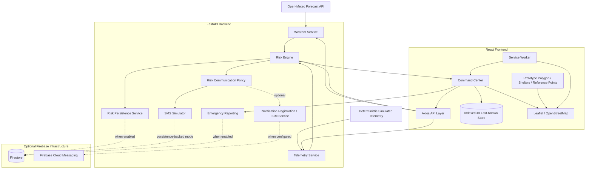

# FlashFlood Architecture

This document describes the architecture that currently exists in the repository. Optional Firebase-backed paths are shown because their code exists, but real cloud configuration is intentionally postponed.

## System Diagram



## Backend Responsibilities

### Weather Service

The backend owns Open-Meteo access and normalization.

It:

- requests upstream and downstream weather separately,
- normalizes the provider response,
- distinguishes `FULL`, `PARTIAL`, and `UNAVAILABLE`,
- never converts unavailable rainfall into zero,
- calculates the cross-location maximum live/forecast rainfall used by the risk request.

### Telemetry Service

Telemetry is deterministic demonstration data.

The backend exposes:

- `GET /api/telemetry/latest`
- `GET /api/telemetry/demo/{scenario}`

The selected demo scenario is in process memory.

### Risk Engine

The FastAPI backend is authoritative for risk.

The React frontend does not reproduce the risk formula. A new risk result requires valid current weather and telemetry.

### Persistence

`firestore_service.py` provides optional Firestore persistence for risk assessments.

Persistence is disabled by default.

### Communication Policy

`risk_communication_service.py` handles backend risk-transition communication.

With Firestore-backed communication enabled, the existing policy is:

1. capture the previous authoritative persisted risk,
2. persist the current risk,
3. communicate only on severity increase,
4. attempt FCM first,
5. for RED only, use the SMS simulator when there are zero successful FCM destinations.

The portfolio-only local SMS mode is narrower:

- enabled only when `SMS_SIMULATOR_ENABLED=true`,
- Firestore is disabled,
- FCM is disabled,
- live backend risk evaluations keep an in-memory transition baseline,
- a live escalation to RED creates a simulated event,
- it never contacts a telecom provider.

### Emergency Reporting

The emergency-report route accepts only:

- a fixed category,
- a bounded message.

The backend does not accept identity, phone, exact coordinates, arbitrary status, or client-selected document identifiers.

Persistence requires the emergency-reporting and Firestore configuration flags.

## Frontend Responsibilities

### API Layer

`frontend/src/services/api.js` contains the narrow backend API functions.

### Command-Center Data Hook

`useCommandCenterData.js` coordinates:

- health,
- weather,
- telemetry,
- backend risk evaluation,
- last-known fallback display,
- browser connectivity,
- operating mode.

A critical safety boundary is preserved:

```text
cached weather / telemetry
        ↓
display only

cached risk
        ↓
display only
```

Cached data is not used to produce a new offline risk result.

### IndexedDB

`offlineStore.js` stores only non-sensitive prototype snapshots:

- weather,
- telemetry,
- risk.

Each entry retains `savedAt`, which is used for `LAST KNOWN — NOT LIVE` presentation.

### Service Worker

`frontend/public/sw.js` maintains separate caches for:

- the application shell,
- previously loaded OpenStreetMap tiles.

It does not intentionally cache backend API responses.

### Map

The map uses Leaflet and OpenStreetMap.

Static frontend data includes:

- study reference points,
- prototype affected-area polygon,
- prototype shelters.

The polygon and shelter data are demonstration geography only.

## Connectivity States

The frontend tracks two different facts:

```text
navigator.onLine      -> browser/client connectivity indicator
backendStatus         -> FlashFlood backend reachability
```

They are intentionally not collapsed into one state.

The derived command-center modes are:

- **FULL ONLINE**
- **DEGRADED**
- **OFFLINE**
- transient **CHECKING**

## Trust Boundaries

- Browser data is treated as untrusted input.
- Authoritative risk is produced only by the backend.
- Firebase Admin credentials belong only on the backend.
- Cached frontend risk cannot trigger FCM or SMS.
- Service Worker map caching is allowlisted to OpenStreetMap tile image requests.
- The SMS simulator has no telecom-provider credential or delivery integration.

## Prototype Boundaries

The architecture demonstrates software flow; it does not establish hydrological validity. Production deployment would require official data sources, calibrated thresholds, validated emergency workflows, authentication/authorization, operational observability, and responsible-authority review.
